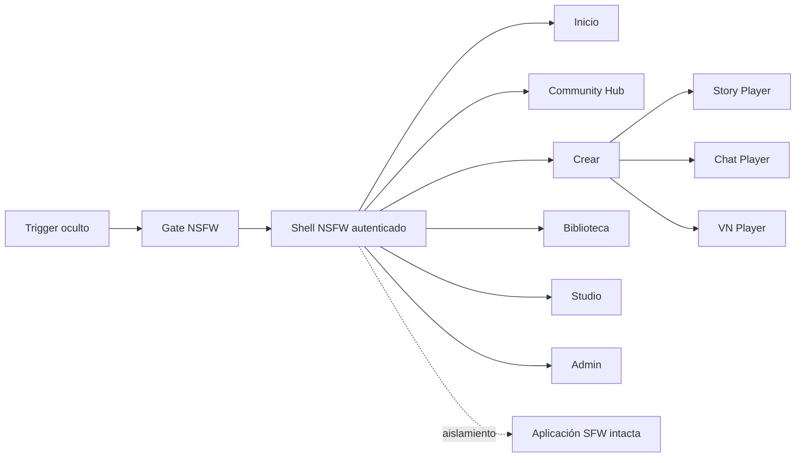
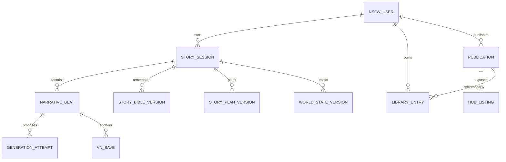
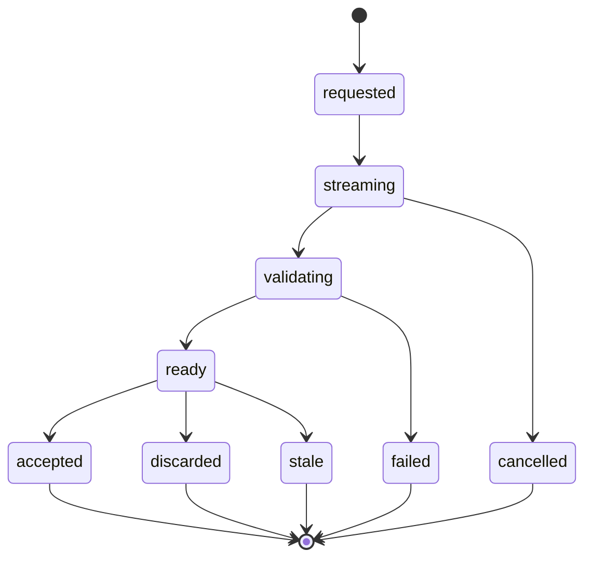

# Diseño técnico y UX/UI: Mis Historias NSFW

- Estado: diseño propuesto para implementación incremental
- Fecha: 2026-08-21
- Fuente de producto: `tasks/prd-nsfw.md`
- Ámbito: parte oculta NSFW; la aplicación SFW queda intacta
- Stack conservado: Nuxt, TypeScript, Pinia, SQLite, LM Studio, Chrome LLM y SwarmUI

## 1. Propósito y límites

Este documento traduce el PRD NSFW a una arquitectura implementable y a una especificación visual. La parte privada deja de ser un simple cambio de `scope` sobre las páginas SFW: se convierte en un producto paralelo dentro del mismo proceso Nuxt.

Se conservan:

- almacenamiento SQLite y backups/migraciones existentes;
- LM Studio y Chrome LLM como proveedores narrativos locales;
- SwarmUI únicamente para crear assets en Studio;
- el trigger oculto existente para entrar y el control para salir;
- toda la aplicación SFW, sus rutas, tipos, stores, parser y aspecto.

No se incorporan hosting, cloud workers, Convex, S3, licencias, age assurance, OAuth, email, políticas legales, auditoría de seguridad, inspección administrativa de historias ni generación visual durante el play.

## 2. Principios de arquitectura

1. **Aislamiento:** nuevas rutas, APIs, tablas, tipos, stores, layout y players bajo namespace NSFW.
2. **Servidor autoritativo:** autenticación, ownership, aceptación de intentos y mutación narrativa ocurren en servidor.
3. **Historia inmutable:** un Accepted Beat no se reescribe; ediciones, re-rolls y ramas crean revisiones o nodos nuevos.
4. **Envelope, no parser:** la prosa libre nunca actúa como comando ni id.
5. **Formatos reales:** Chat, VN y Story comparten dominio, no presentación ni contrato de escritura.
6. **Proveedor intercambiable:** Quick/Quality y modelo son ejes independientes.
7. **SFW congelado:** ninguna migración convierte silenciosamente sus tipos o rutas.



## 3. Arquitectura actual y separación

| Actual | Problema para NSFW | Destino |
|---|---|---|
| `app/stores/privacy.ts` cambia `scope` | No autentica ni cambia de producto | Trigger navega a `/private/login`; sesión separada |
| `app/layouts/default.vue` | Navegación SFW compartida | `app/layouts/private.vue` |
| `shared/types/index.ts` | `Story`, `Message`, `visualMode` lineales | `shared/types/nsfw/` |
| `server/api/data/[...path].ts` | CRUD genérico sin usuario | `/api/private/*` autenticada |
| `app/stores/stories.ts` | Mensajes y reveal simulado | Stores NSFW de sesiones/intentos |
| `app/lib/streamParser.ts` | Líneas y corchetes como verdad | JSON Schema + validator |
| `app/pages/stories/[id].vue` | Chat y VN en una página | Tres players nuevos |
| `.private-scope` rosa | No corresponde al estilo | `.nsfw-scope` editorial oscuro |

### 3.1 Código SFW que no debe convertirse

- `app/pages/stories/*`
- `app/components/MessageBubble.vue`
- `app/components/VisualNovelStage.vue`
- `app/lib/streamParser.ts`
- `app/stores/stories.ts`
- interfaces SFW de `shared/types/index.ts`
- API y tablas SFW existentes

Se permite extraer una utilidad neutral únicamente si sus tests prueban que SFW no cambia.

## 4. Rutas y módulos

### 4.1 Rutas cliente

```text
/private/login
/private                         Inicio
/private/create
/private/library
/private/hub
/private/hub/:type/:id
/private/studio/characters
/private/studio/places
/private/studio/experiences
/private/studio/publications
/private/studio/media
/private/play/story/:sessionId
/private/play/chat/:sessionId
/private/play/vn/:sessionId
/private/profile
/private/admin/users
/private/admin/taxonomy
/private/admin/publications
/private/admin/feedback
/private/admin/generations
/private/legacy/:storyId
```

### 4.2 Árbol de código propuesto

```text
shared/types/nsfw/
shared/schemas/generation-envelope.v1.json
server/utils/nsfwAuth.ts
server/utils/nsfwStorage.ts
server/services/nsfw/
  generationOrchestrator.ts
  promptBundle.ts
  envelopeValidator.ts
  storyState.ts
  modelCatalog.ts
server/api/private/
app/layouts/private.vue
app/middleware/private-auth.ts
app/pages/private/**
app/components/private/**
app/stores/nsfwAuth.ts
app/stores/nsfwSessions.ts
app/stores/nsfwGeneration.ts
app/stores/nsfwLibrary.ts
app/stores/nsfwHub.ts
app/stores/nsfwStudio.ts
app/lib/nsfw/**
server/nsfw/skills/**
tests/e2e/private-*.spec.ts
```

## 5. Identidad y sesiones locales

### 5.1 Flujo

1. Trigger oculto SFW navega al gate NSFW.
2. `GET /api/private/auth/status` indica bootstrap, login o sesión activa.
3. Si no hay usuarios, se crea el primer Administrador.
4. Si existen, se solicita username y password.
5. Login correcto crea sesión httpOnly y navega a `/private`.
6. Logout vuelve al login NSFW.
7. Salir del modo privado cierra sesión y vuelve a SFW.

No hay registro de usuario. Solo el Administrador crea cuentas.

### 5.2 Tablas mínimas

```sql
nsfw_users (
  id TEXT PRIMARY KEY,
  username TEXT NOT NULL UNIQUE COLLATE NOCASE,
  password_hash TEXT NOT NULL,
  role TEXT NOT NULL CHECK (role IN ('user','admin')),
  active INTEGER NOT NULL DEFAULT 1,
  avatar_asset_id TEXT,
  created_at INTEGER NOT NULL,
  updated_at INTEGER NOT NULL,
  last_login_at INTEGER
)

nsfw_sessions (
  id TEXT PRIMARY KEY,
  user_id TEXT NOT NULL,
  token_hash TEXT NOT NULL UNIQUE,
  expires_at INTEGER NOT NULL,
  created_at INTEGER NOT NULL
)
```

Password nunca se almacena ni devuelve en claro. Un helper de servidor resuelve la sesión y `userId`; las APIs de contenido comprueban ownership. Son controles mínimos inseparables de la función multiusuario, no el paquete de seguridad de Empty Spaces.

### 5.3 Admin de usuarios

- listar username, rol, estado y último acceso;
- crear username/password/rol;
- editar username y rol;
- resetear password;
- activar/desactivar;
- impedir desactivar o degradar al último Administrador activo;
- no borrar físicamente cuentas.

## 6. Modelo de datos

### 6.1 Catálogo y Studio

- `nsfw_characters`: identidad/defaults, sin biografía.
- `nsfw_character_sprites`: un personaje transparente y facetas completas.
- `nsfw_places`: localización de escena.
- `nsfw_place_background_versions`: un fondo vigente por versión.
- `nsfw_scene_cgs`: escenas completas precatalogadas.
- `nsfw_settings`, `nsfw_eras`.
- `nsfw_experiences`: premisa, slots, variables, reglas, perfil, seeds y finales.
- `nsfw_experience_versions` y drafts.
- `nsfw_media_assets`: blobs/metadatos de imagen y sonido.
- `nsfw_taxonomy_terms`, proposals y discarded.
- `nsfw_self_insert_profiles`.

### 6.2 Runtime narrativo

```text
StorySession
  ├─ Cast + StoryCharacterizations + Overrides
  ├─ StoryPlan versionado
  ├─ StoryBible versionada
  ├─ WorldState versionado
  ├─ AssetPins
  └─ headBeatId

NarrativeBeat (inmutable)
  ├─ parentBeatId
  ├─ acceptedAttemptId
  ├─ envelope
  └─ snapshotVersion

GenerationAttempt
  ├─ parentBeatId
  ├─ siblingGroupId
  ├─ inputFingerprint
  ├─ modelAlias + modelId
  ├─ generationProfile
  ├─ skillVersions
  ├─ usage
  └─ state
```

Tablas:

- `nsfw_story_sessions`
- `nsfw_session_cast`
- `nsfw_story_plans`
- `nsfw_story_bible_versions`
- `nsfw_world_state_versions`
- `nsfw_beats`
- `nsfw_generation_attempts`
- `nsfw_generation_usage`
- `nsfw_vn_saves`
- `nsfw_read_units`

Una rama nueva referencia el beat ancestro y crea snapshots de Plan/Bible/State. Los beats aceptados son inmutables y compartibles por referencia.

### 6.3 Biblioteca y Hub

- `nsfw_library_entries`
- `nsfw_publications` y snapshots inmutables
- `nsfw_serials` y episodios
- `nsfw_hub_listings`
- `nsfw_derivative_sources`
- `nsfw_follows`
- `nsfw_collections` y entries
- `nsfw_comments`
- `nsfw_ratings`
- `nsfw_product_feedback`

`LibraryEntry` es una referencia, no una copia del blob. Retirar un listing bloquea nuevos Add sin romper entries existentes.

### 6.4 Invariantes

- username único sin distinguir mayúsculas;
- cada recurso privado tiene `owner_user_id`;
- una generación activa por rama;
- un Attempt solo se acepta si su fingerprint coincide con el head actual;
- un sibling group tiene como máximo un intento aceptado;
- saves, backlog y publicaciones referencian Accepted Beats;
- formato inmutable por sesión;
- publication snapshot inmutable;
- modelo y perfil cambian solo el siguiente intento;
- SFW nunca consulta tablas `nsfw_*`.



## 7. Catálogo de modelos y selección

Modelo y Generation Profile son decisiones independientes.

Aliases iniciales obligatorios:

1. Gemma-4-26B-A4B StyleTune V2 + Heretic
2. Gemma-4-31B StyleTune Heretic ARA
3. G4-Dark-Soul-26B-A4B

### 7.1 Configuración

`modelCatalog` guarda:

```ts
interface NarrativeModelConfig {
  alias: string
  lmStudioModelId: string
  enabled: boolean
  quickDefaults: SamplingConfig
  qualityDefaults: SamplingConfig
  contextBudget: number
}
```

El selector se muestra:

- en el paso 3 de creación;
- en controles secundarios del player;
- al solicitar re-roll/comparación.

La API consulta los modelos disponibles de LM Studio. Si un alias no está disponible:

- aparece deshabilitado con explicación;
- no se reemplaza silenciosamente;
- el intento no comienza.

### 7.2 Comparación justa

“Comparar con otro modelo” crea un Attempt hermano usando exactamente:

- parent beat;
- input;
- Bible, Plan y World State;
- Characterizations y asset pins;
- Interaction Policy;
- Generation Profile, salvo que el usuario también lo cambie explícitamente.

Cada resultado enseña alias/model id, perfil, latencia y tokens. Solo el elegido altera estado.

## 8. Motor narrativo

### 8.1 Generation Envelope v1

```ts
interface GenerationEnvelope {
  schemaVersion: 1
  language: 'es-ES'
  format: 'chat' | 'visual_novel' | 'story'
  visibleUnits: VisibleUnit[]
  visualCues: VisualCue[]
  soundCues: SoundCue[]
  choices: SuggestedInteraction[]
  stateDelta: StateOperation[]
  planPatch: PlanOperation[]
  stopReason: StopReason
}
```

`VisibleUnit` distingue narración y diálogo. El diálogo lleva `actorId`, `spriteQuery` y Speech Annotation opcional. `VisualCue` selecciona Place/Sprites o un `sceneCgAssetId`; todos los ids deben estar en los pins de la sesión.

La UI escapa texto y no interpreta HTML, nombres, corchetes ni prefijos como comandos.

### 8.2 Estados de generación



Flujo:

1. Cliente envía session, expected revision, input tipado, modelo, perfil y request id.
2. Servidor comprueba owner y ausencia de intento activo.
3. Crea Attempt y fingerprint.
4. Construye PromptBundle.
5. Ejecuta pipeline y emite chunks provisionales.
6. Valida envelope, ids, tags, deltas y exclusiones.
7. Marca `ready`; no cambia historia.
8. Aceptar vuelve a validar fingerprint y aplica envelope en transacción.
9. Si stale, descarta sin tocar head.
10. Un fallo recuperable reintenta una vez; después ofrece Retry, Quick, cambiar modelo, editar y Reportar bug.

### 8.3 Streaming

- LM Studio: endpoint NSFW SSE/chunked, sin cambiar el endpoint SFW.
- Chrome LLM: streaming nativo si existe; si no, resultado bufferizado con reveal provisional, claramente indicado.
- eventos: `chunk`, `validating`, `ready`, `failed`, `stale`, `cancelled`.
- stop conserva texto copiable solo en memoria; nunca crea beat.

### 8.4 PromptBundle

Orden:

1. schema;
2. contrato de formato;
3. agencia/stopping;
4. skills versionadas;
5. Experience y preferencias;
6. escena/plan;
7. Bible;
8. resumen;
9. reciente;
10. input.

Contexto: escena actual, presentes, Characterizations, relaciones, estado, hechos relevantes, secretos necesarios para el narrador, resumen por arcos, 8–20 intercambios aceptados, próximo plan y assets. Truncado nunca elimina Exclusions, presentes, escena o input.

### 8.5 Quick

- una llamada principal;
- intención breve dentro del envelope;
- validación determinista;
- un retry correctivo si JSON/delta es inválido.

### 8.6 Quality

1. Planner: beat intent, checklist de continuidad y stop target.
2. Writer: envelope.
3. Critic: literatura/castellano, personajes, continuidad, pacing, agencia y contenido adulto.
4. Revision: solo si falla umbrales configurados.
5. Extractor/validator: ids, state, plan y constraints.

Puede usar otro modelo/configuración local, más contexto y más pases. Todos consumen la misma verdad narrativa.

### 8.7 Skills

Registry versionado: Voz de España, Diálogo/subtexto, Escena/causalidad, Personaje/relación, Pacing, Sensualidad, Explicitud, Continuidad, Agencia, Anticliché, contratos Chat/VN/Story, Speech y Final/secuela. El Attempt fija versiones.

## 9. Memoria, edición y ramas

### 9.1 Separación de verdad

- World State: estado actual estructurado.
- Bible: hechos canónicos versionados y procedencia.
- Plan: futuro mutable, no promesa.
- Summary: compresión de arcos.
- Recent: ventana de Accepted Beats.
- Scene State: localización, presentes, intención y pacing.

Secretos no se envían al cliente hasta que el protagonista los conoce. El Administrador no tiene función de revelarlos.

### 9.2 Edición

- estilística: nueva revisión visible, mismo snapshot factual;
- factual: UI muestra propuesta de cambios en Bible/State; confirmar genera nueva versión;
- sin sincronizar: no puede publicarse ni usarse como punto de rama.

### 9.3 Re-roll y ramas

- re-roll = Attempt hermano;
- comparación de modelos = re-roll con model distinto;
- rama = nueva Story Session desde Accepted Beat y snapshots;
- secuela = sesión nueva vinculada al final anterior y Characterizations nuevas;
- original nunca cambia.

## 10. Players

### 10.1 Elementos compartidos

- aviso de historia privada;
- indicador formato, modelo y Quick/Quality;
- estado provisional/validando/ready;
- aceptar, re-roll, comparar, editar;
- corazón de escalada;
- Bible, Director, usage, ramas, audio “Próximamente”;
- feedback discreto;
- compositor específico del formato.

### 10.2 Story

Desktop: columna principal de lectura + aside de escena/controles. Móvil: una columna y controles en sheets.

- serif, 200–600 palabras orientativas;
- diálogo sustancial;
- compositor amplio con Speak/Act y sugerencias secundarias;
- no burbujas de chat;
- punto natural de decisión.

### 10.3 Chat

- thread `max-width: 48rem`;
- avatar/sprite por intervención;
- narración breve diferenciada;
- input corto, Speak/Act y acciones rápidas;
- 40–150 palabras por beat;
- portrait intencional;
- no importa `MessageBubble.vue`.

### 10.4 Visual Novel

Capas:

1. fondo de Place;
2. overlay/ambiente;
3. sprites transparentes en slots izquierda/centro/derecha y profundidad, o Scene CG;
4. transición;
5. caja de nombre/diálogo;
6. choices/controles.

Sprite query:

```ts
interface SpriteQuery {
  required: Facet[]
  preferred: WeightedFacet[]
  excluded: Facet[]
}
```

Algoritmo: excluir incompatibles → exigir required → puntuar preferred → fallback neutral → sin asset. Nunca inventar.

Controles:

- backlog de Accepted Beats;
- autosave por beat y saves manuales nombrados;
- auto por longitud/puntuación/preferencia;
- skip solo de unidades leídas en esa rama; ancestros conservan leído;
- velocidad, transiciones, volumen, fullscreen, reduced motion;
- teclado, touch y controles visibles;
- galería de Sprites/CGs vistos;
- choices integradas.

Landscape es preferido. En portrait se apilan stage, diálogo y choices; el aviso de rotación no bloquea.

## 11. Studio y Experiences

### 11.1 Personaje

Secciones progresivas: identidad, físico/anatomía, personalidad, límites/preferencias, voz, Relationship Hooks, Sprites. No hay biografía canónica. Preview detecta facetas incompletas.

### 11.2 Place

Nombre, descripción, Setting, Era y un fondo versionado. No Zone ni grafo.

### 11.3 Media

Sprites, fondos, Scene CGs y sonidos. SwarmUI crea assets aquí. Ninguna generación visual en play.

### 11.4 Experience

Premisa, slots tipados, variables, reglas, Adult Content Profile, hooks, plan seeds, finales y cobertura. Preview muestra gaps por Personaje/Sprite/Place/CG.

### 11.5 Publicación

Draft → Preview → Validación estructural → autorización explícita → publicación automática. Sin licencia. Snapshot inmutable; retirar oculta; republicar crea otro.

## 12. Biblioteca y Community Hub

Biblioteca: En curso, Terminadas, Guardadas, Experiences, Personajes, Lugares, Colecciones y Archivados. Filtros por formato, estado, origen, tags, creador, fecha y favorito.

Hub autenticado:

- tabs Stories/Series, Experiences, Characters, Places, Creators, Collections;
- búsqueda y facetas;
- recientes, tendencias y colecciones editoriales;
- portadas explícitas visibles directamente;
- ficha de creador;
- CTA Play/Read/Branch/Add;
- comentarios, ratings dimensionales, follows y colecciones.

Nada del Hub se sirve al shell SFW, login o una ruta sin sesión.

## 13. Migración del legado privado

1. Backup previo con mecanismo existente.
2. Crear tablas `nsfw_*`.
3. Bootstrap crea primer Admin.
4. Asignar assets legacy al primer Admin mediante paso explícito post-bootstrap.
5. Migrar Personajes, imágenes, fondos y sonidos a drafts; marcar facetas incompletas.
6. Convertir `privateUserName` y preferencias en Self-insert inicial.
7. Mantener historias/mensajes en tablas legacy.
8. `/private/legacy/:id` las muestra en solo lectura.
9. “Iniciar nueva versión” copia premisa, reparto y assets compatibles; no mensajes ni estado inferido.

No hay conversión automática a Chat nuevo.

## 14. Lenguaje visual Empty Spaces

### 14.1 Principios

Oscuro, cinematográfico, editorial, premium y discreto. No estética porn-site en el chrome ni skin anime global. Cada Experience puede ajustar acento dentro del player, no reemplazar controles.

### 14.2 Tokens

| Token | Valor | Uso |
|---|---|---|
| ink | `#f2ece4` | texto |
| muted | `#aca49d` | secundario |
| faint | `#746d68` | metadata |
| canvas | `#100d0e` | raíz |
| surface | `#171315` | panel |
| raised | `#211b1d` | cards/compositor |
| soft | `#2b2224` | hover/input |
| line | `rgba(235,220,208,.16)` | borde |
| accent | `#ff755f` | CTA/activo |
| gold | `#e0b46a` | VN/rating |
| azure | `#72b5d0` | info/ramas |
| danger | `#e05a5a` | error |
| success | `#6db88a` | confirmación |

Tipografía:

- títulos y prosa Story/VN: Iowan Old Style, Palatino, Georgia;
- UI/Chat: Aptos, Segoe UI Variable, system sans;
- H1 `clamp(2.3rem,4vw,4rem)`;
- Story `clamp(1.16rem,1.5vw,1.35rem)`, line-height 1.65.

Escala 4 px; radios 6/12/16/pill. Foco coral de 2 px. Touch target mínimo 44 px.

### 14.3 Shell

Desktop ≥901 px: rail de 260 px, Inicio/Hub/Crear/Biblioteca; Studio/Admin abajo; perfil. En player colapsa a 64 px.

Móvil ≤900 px: bottom nav de cuatro ítems; avatar abre Perfil/Studio/Admin/logout. Safe areas obligatorias.

### 14.4 Entrada

Gate full-bleed oscuro sin portada explícita. Bootstrap y login comparten card de 28 rem. Error genérico. El estilo NSFW solo se activa en gate y rutas privadas; contenido explícito no se muestra hasta autenticación.

### 14.5 Contenido explícito

- SFW, trigger y login: nunca.
- Hub autenticado: portadas explícitas directas, según decisión del usuario.
- Studio: dentro de preview.
- Player: stage/reader.
- Admin de usuarios: nunca.

## 15. Responsive y accesibilidad

- 320 y 390 px: sin overflow horizontal.
- grids a una columna ≤700 px.
- facets con scroll interno, no de página.
- compositor móvil sobre safe area.
- VN portrait: stage ≤55vh, diálogo y choices debajo.
- VN landscape: stage casi full viewport, chrome autoocultable.
- WCAG AA, foco visible, navegación teclado.
- `aria-live=polite` para generación.
- Space/Enter avanza VN; Escape cierra panels; números eligen choices.
- reduced motion elimina pulsos/transiciones y deja opacity instantánea.

## 16. Estados UI

| Superficie | Loading | Empty | Error | Success |
|---|---|---|---|---|
| Login | CTA busy | bootstrap | credenciales inválidas | redirect |
| Inicio | skeleton | primera historia | carga | continue |
| Hub | skeleton | sin recursos | búsqueda | cards |
| Crear | preparación | — | validación | play |
| Player | requested | primer input | retry/Quick/modelo | beat |
| Studio | draft | crear | gaps | publicado |
| Admin | tabla | sin items | acción | actualizado |

Provisional se muestra atenuado con etiqueta. Ready habilita aceptación. Stale informa y descarta. Failed elimina provisional.

## 17. APIs principales

```text
GET/POST /api/private/auth/*
GET/POST/PATCH /api/private/admin/users/*
GET/PATCH /api/private/admin/model-configs/*
GET/POST /api/private/stories
GET/PATCH /api/private/stories/:id
POST /api/private/stories/:id/generate
POST /api/private/attempts/:id/accept
POST /api/private/attempts/:id/discard
POST /api/private/beats/:id/fork
POST /api/private/stories/:id/sequel
GET/PATCH /api/private/stories/:id/bible
GET/PATCH /api/private/stories/:id/plan
GET/POST /api/private/vn-saves
GET/POST/PATCH /api/private/studio/*
GET/POST /api/private/hub/*
GET/POST/PATCH /api/private/library/*
```

## 18. Pruebas

Unit:

- auth y último Admin;
- envelope schema;
- operaciones Plan/Bible/State;
- fingerprint stale;
- sprite selection;
- model alias/id availability;
- branches/shared ancestry;
- saves/read units.

Integration:

- SQLite migrations;
- server→LM Studio fixture→envelope;
- Quick y Quality;
- publicación/add/retirada;
- migración de assets legacy.

E2E:

- bootstrap/login/desactivar;
- crear/play/fail/resume;
- re-roll/model comparison/fork/sequel;
- los tres formatos;
- VN saves/auto/skip/CG;
- Studio/Hub/Library;
- legacy read-only;
- nada NSFW visible en SFW/login.

Visual:

- desktop;
- 320 y 390 portrait;
- VN desktop, móvil landscape y portrait;
- loading, empty, error, provisional, long text, large text y reduced motion.

## 19. Secuencia

### M0

Tablas y auth, gate, shell/tokens, CRUD usuarios, ownership, modelo catalog básico.

### M1

Crear desde cero, Story, envelope/streaming, state/Bible/Plan, aceptación/fallo, selector de modelo.

### M2

Re-roll y comparación de modelos, ramas, edición/sync, secuela, Biblioteca/archivo.

### M3

Chat y VN nuevos, sprites/CG, backlog, saves, auto, skip y responsive.

### M4

Studio, Experiences, taxonomía, Hub, publicación y comunidad local.

### M5

Quality, skills, feedback, usage y Admin de producto.

### M6

Accesibilidad, matriz visual, medición de latencia, catálogo semilla, migración legacy y regresión SFW.

## 20. Riesgos

- JSON imperfecto de modelos locales: schema mode si existe, repair + un retry.
- Quality demasiado lento: objetivos medidos, Quick siempre disponible.
- model ids variables: aliases configurables y no fallback silencioso.
- Chrome LLM sin streaming/schema: capability check y disponibilidad visible.
- dos productos en un repo: namespaces y tests de regresión.
- facetas incompletas en assets legacy: drafts con gaps, no inventar tags.
- ramas profundas: beats inmutables y property tests.
- portadas explícitas en Hub: garantizar autenticación antes de servir metadata/blob.
- test-data no limpia privado: DB de pruebas NSFW aislada.

## 21. Definition of Done

Un milestone termina cuando:

- alcance vertical usable;
- requisitos trazados;
- tests unit/integration/E2E relevantes;
- `pnpm lint`;
- navegador real desktop y móvil;
- 320/390 sin overflow; VN landscape/portrait;
- ningún cambio funcional o visual accidental en SFW;
- docs y migraciones actualizadas;
- no hay TODO crítico oculto.
