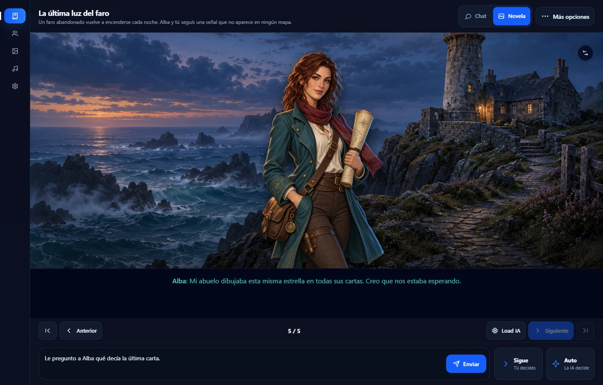
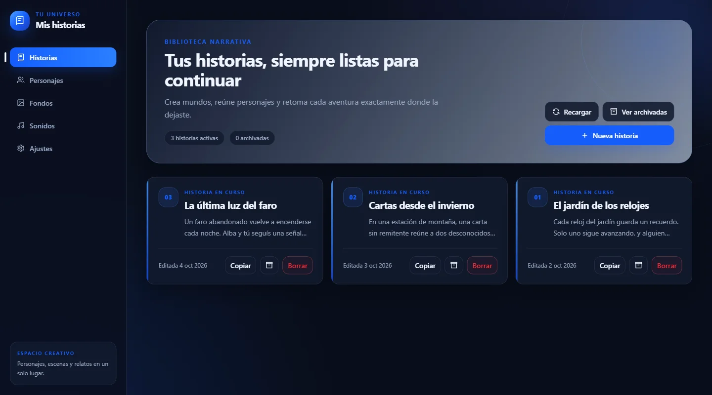
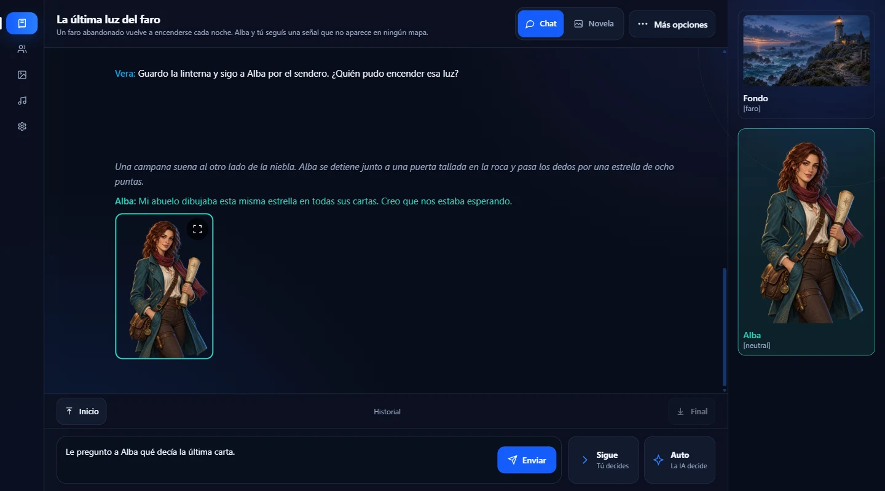

# Mis Historias

**Crea personajes. Imagina un mundo. Decide cómo sigue la historia.**

Mis Historias es un espacio para escribir y protagonizar historias interactivas con IA.
Tú eliges el planteamiento, los personajes y tus acciones; el narrador da vida a la aventura.
Léela como una conversación o conviértela en una novela visual con escenarios, imágenes y sonido.

[Descargar para Windows o Ubuntu](https://github.com/jonatancheca/MisHistorias/releases/latest) ·
[Ver capturas](#capturas) · [Primeros pasos](#primeros-pasos) · [Desarrollo](#desarrollo)



*Novela Visual: escenario, personaje y diálogo en una misma escena.*

## Tu próxima aventura empieza aquí

- **Personajes con identidad.** Define su personalidad, su voz y su aspecto. Reutilízalos en otras historias o adapta sus rasgos a cada aventura.
- **Dos formas de leer.** Alterna entre Chat y Novela Visual dentro de la misma historia, sin perder el hilo.
- **Tú marcas el rumbo.** Escribe lo que haces o dices, pide que la historia siga o deja que la IA decida por el protagonista.
- **Escenas con ambiente.** Combina fondos, imágenes de personajes, efectos de sonido y audio ambiental. Puedes importar imágenes o generarlas con SwarmUI.
- **Historias que puedes retomar.** Guarda partidas, recupera un momento anterior, copia una historia para explorar otro camino o archívala para más adelante.
- **Tu biblioteca en tu instalación.** Historias, personajes y recursos se guardan en SQLite. Incluye importación, exportación y copias de seguridad desde Ajustes.

La narración funciona con **LM Studio**, ejecutado en tu equipo o en un servidor accesible.
**SwarmUI es opcional** y se utiliza para generar imágenes. Los modelos se configuran por separado;
el rendimiento depende del modelo y del equipo que lo ejecuta.

## Capturas

### Una biblioteca para todos tus mundos

Retoma una aventura, crea otra o explora una variante a partir de una historia existente.



### Una conversación que tú haces avanzar

Sigue la narración, conversa con los personajes y prepara tu próxima intervención mientras
mantienes a la vista el escenario y el elenco.



*Capturas reales de la aplicación con una historia de ejemplo. Las ilustraciones se han generado
para estas capturas y se han importado como recursos; no vienen incluidas al instalar la app.*

## Instalar y empezar

Las [releases](https://github.com/jonatancheca/MisHistorias/releases/latest) incluyen Node.js:
**no necesitas instalar Node.js ni pnpm para usar los paquetes descargables**.

### Windows x64

1. Descarga [`app.zip`](https://github.com/jonatancheca/MisHistorias/releases/latest/download/app.zip).
2. Extrae **todo** su contenido en una carpeta.
3. Ejecuta `start.bat`. Se abrirá [Mis Historias en tu navegador](http://localhost:3010).

Mantén abierta la ventana del servidor mientras uses la aplicación.

### Ubuntu 26.04 LTS x64

1. Descarga [`app-linux-x64.tar.gz`](https://github.com/jonatancheca/MisHistorias/releases/latest/download/app-linux-x64.tar.gz).
2. Extrae su contenido en la carpeta donde quieras conservar la instalación.
3. Abre una terminal en esa carpeta y ejecuta:

```bash
sudo ./install.sh
```

Abre [Mis Historias en tu navegador](http://localhost:3010). El instalador configura
`mishistorias.service` para arrancar con Ubuntu y ejecutarse como el usuario que invocó `sudo`.

Los paquetes guardan los datos en `install1/.data`. Conserva esa carpeta al mover la instalación.
Consulta las guías de [Windows](scripts/release-readme.md) y [Ubuntu](scripts/release-readme-linux.md)
para más detalles.

### Primeros pasos

1. **Conecta el narrador.** Arranca el servidor de LM Studio. En **Ajustes**, indica su URL
   —por ejemplo, `http://localhost:1234`, sin `/v1`—, prueba la conexión y selecciona el modelo de historias.
   La URL debe ser accesible desde el equipo que ejecuta Mis Historias.
2. **Crea tu elenco.** En **Personajes**, escribe cómo es cada personaje y añade sus imágenes.
3. **Prepara el escenario.** Añade fondos y sonidos si quieres acompañar la narración.
4. **Empieza una historia.** Elige **Nueva historia**, define el planteamiento y selecciona los personajes.
5. **Entra en la aventura.** Escribe tu primera intervención y alterna entre **Chat** y **Novela** cuando quieras.

Para generar imágenes desde la aplicación, conecta también SwarmUI en **Ajustes**.

### Actualizaciones y copias de seguridad

La aplicación comprueba nuevas versiones al arrancar. También puedes comprobarlas desde
**Ajustes** y descargar el actualizador más reciente.

Desde la carpeta instalada, ejecuta el comando de tu sistema:

**Windows**

```powershell
PowerShell -ExecutionPolicy Bypass -File .\update.ps1
```

**Ubuntu**

```bash
sudo ./update.sh
```

Los actualizadores verifican el checksum, conservan `install1/.data` y restauran la versión
anterior si falla la comprobación de salud. Desde **Ajustes** puedes descargar un backup SQLite
completo; guárdalo en un lugar seguro, ya que incluye la configuración y las credenciales de las integraciones.

La instalación local no activa autenticación ni HTTPS por sí sola. Para exponerla en red,
protégela con Cloudflare Tunnel y Access y configura el modo multiusuario desde **Ajustes**.

## Desarrollo

Esta sección reúne las instrucciones para trabajar con el código fuente.
La aplicación utiliza **Nuxt 4, Vue 3, TypeScript, Pinia, Tailwind CSS y SQLite**.

### Requisitos y arranque

- Node.js **24.15.0 o posterior**.
- pnpm **11.2.0**, versión indicada en `package.json`.
- LM Studio accesible para probar la generación de historias; SwarmUI para la generación de imágenes.

```bash
git clone https://github.com/jonatancheca/MisHistorias.git
cd MisHistorias
pnpm install
pnpm dev
```

El servidor de desarrollo escucha en **http://localhost:3069**. `pnpm dev` limita el acceso al
equipo local; `pnpm dev2` lo habilita en las interfaces de red, también en el puerto **3069**.

### Ejecutar desde el código fuente

```bash
pnpm serve
```

Este comando compila y arranca el frontend y la API en el puerto **3010**.
Mantén la terminal abierta mientras uses la aplicación. Si ya has compilado, `pnpm start`
arranca esa build.

La base de datos se crea por defecto en `.data/mishistorias.sqlite`. Para elegir otra ruta,
define `NUXT_SQLITE_PATH` antes de arrancar. Ejemplo en PowerShell:

```powershell
$env:NUXT_SQLITE_PATH = 'D:\MisHistorias\mishistorias.sqlite'
pnpm serve
```

### Copiar una build a una instalación local

`pnpm local-deploy` compila y copia la aplicación a `../MisHistoriasInstall` por defecto.
Puedes elegir otra carpeta con un parámetro o con `MISHISTORIAS_INSTALL_ROOT`:

```powershell
pnpm local-deploy -- --install-root 'D:\MisHistorias'
```

Alternativa mediante variable de entorno:

```powershell
$env:MISHISTORIAS_INSTALL_ROOT = 'D:\MisHistorias'
pnpm local-deploy
```

### Comprobaciones

```bash
pnpm lint
pnpm test:unit
pnpm test:e2e
```

`pnpm test:storage` es un alias de las pruebas unitarias. Las pruebas de navegador usan
Playwright, arrancan su propio servidor en el puerto **3069** y emplean una base SQLite
separada; deja ese puerto libre antes de ejecutarlas.

Para validar cambios de interfaz durante el desarrollo, utiliza `pnpm dev` y comprueba la
aplicación en el navegador. Consulta [AGENTS.md](AGENTS.md) para las reglas de trabajo del repositorio
y [CONTEXT.md](CONTEXT.md) para su terminología.

El workflow de [releases](.github/workflows/release.yml) genera los paquetes de Windows y Linux,
sus checksums y los actualizadores con cada push a `main`.

## Ideas y mejoras

¿Tienes una idea para contar historias mejor o has encontrado un problema?
[Abre una issue](https://github.com/jonatancheca/MisHistorias/issues) con los detalles.
Si el proyecto te resulta útil, una estrella ayuda a que otras personas lo descubran.
